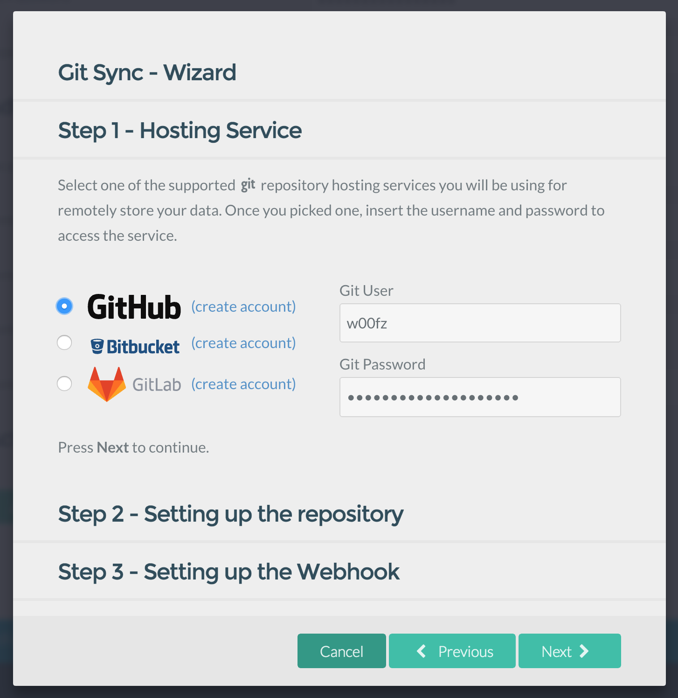

**Git Sync** is a Plugin for [Grav CMS](http://github.com/getgrav/grav) that allows to seamlessly synchronize a Git repository with your Grav site, and vice-versa. 

Git Sync captures any change that you make on your site and instantly updates your git repository. In the same way, Git Sync supports _webhooks_, allowing to automatically synchronize your site if the repository changes.

Thanks to this powerful bi-directional flow, Git Sync can now turn your site into a collaborative environment where the source of truth is always your git repository and unlimited collaborators and sites can share and contribute to the same content.

## Videos: Setup and Demo

| Up and Running in 2 mins | 2-way Sync Demonstration |
| ------------ | ----------------- |
| [](https://www.youtube.com/watch?v=avcGP0FAzB8) | [](https://www.youtube.com/watch?v=3fy78afacyw) |


## Features


 
* Easy step-by-step Wizard setup will guide you through a detailed process for setting things up
* Supported hosting services: [GitHub](https://github.com), [BitBucket](https://bitbucket.org), [GitLab](https://gitlab.com) as well as any self-hosted and git service with webhooks support.
* Private repository
* 2FA (Two-Factor Authentication) and Access Token support
* Webhooks support allow for automatic synchronization from the Git Repository
* Automatically handles simple merges behind the scenes
* Easy one-click button to reset your local changes and restores it to the actual state of the git repository
* Easy one-click button to manually synchronize
* Customize the Committer Name, choose between Git User, GitSync Commiter Name, Grav User Name and Grav user Fullname 
* With the built-in Form Process action `gitsync`, you can trigger the synchronization anytime someone submits a post.
* Any 3rd party plugin can integrate with Git Sync and trigger the synchronization through the `gitsync` event.
* Built-in CLI command to automate synchronizations.

# Command Line Interface

Git Sync comes with a CLI that allows to run synchronizations right within your terminal. This feature is extremely useful in case you'd like to run an autonomous periodic crontab job to synchronize with your repository.

To execute the command simply run:

```bash
bin/plugin git-sync sync
```

# Requirements

In order for the plugin to work, the server needs to run `git` 1.7.1 and above.

# Sponsored by

This plugin could not have been realized without the sponsorship of [Hibbitts Design](http://www.hibbittsdesign.org/blog/) and the development of [Trilby Media](http://trilby.media).
